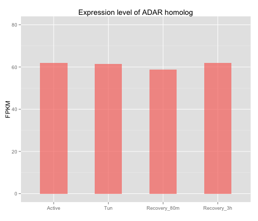

Title
========================================================

This is an R Markdown document. Markdown is a simple formatting syntax for authoring web pages (click the **MD** toolbar button for help on Markdown).

When you click the **Knit HTML** button a web page will be generated that includes both content as well as the output of any embedded R code chunks within the document. You can embed an R code chunk like this:


```r
summary(cars)
```

```
##      speed           dist    
##  Min.   : 4.0   Min.   :  2  
##  1st Qu.:12.0   1st Qu.: 26  
##  Median :15.0   Median : 36  
##  Mean   :15.4   Mean   : 43  
##  3rd Qu.:19.0   3rd Qu.: 56  
##  Max.   :25.0   Max.   :120
```


You can also embed plots, for example:


```r
library(ggplot2)
library(reshape)
```

```
## Loading required package: plyr
```

```
## Attaching package: 'reshape'
```

```
## The following object(s) are masked from 'package:plyr':
## 
## rename, round_any
```

```r

adar_fpkm <- read.table("Adar_yok.fpkm", header = T)
adar_df <- melt(adar_fpkm)
```

```
## Using Adar1 as id variables
```

```r

g <- ggplot(adar_df, aes(x = variable, y = value, fill = Adar1)) + geom_bar(width = 0.5, 
    alpha = 0.7) + # scale_fill_manual(values=c('gray') ) +
ylim(0, 80) + labs(title = "Expression level of ADAR homolog", y = "FPKM", x = "") + 
    theme(legend.position = "none")  # legend is invisible
plot(g)
```

```
## Mapping a variable to y and also using stat="bin".  With stat="bin", it
## will attempt to set the y value to the count of cases in each group.  This
## can result in unexpected behavior and will not be allowed in a future
## version of ggplot2.  If you want y to represent counts of cases, use
## stat="bin" and don't map a variable to y.  If you want y to represent
## values in the data, use stat="identity".  See ?geom_bar for examples.
## (Deprecated; last used in version 0.9.2)
```

 

```r
# ggsave( filename=(paste('Adar_expression_yok.png')), plot=g, width=6,
# height=4, dpi = 300 )

```


